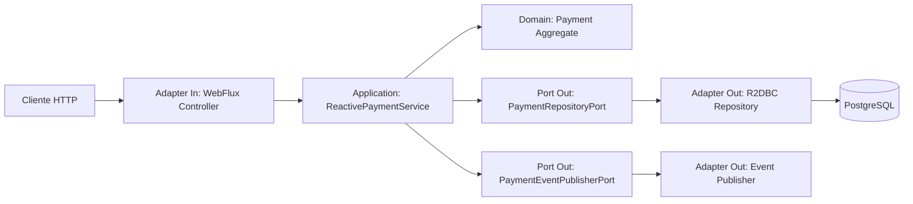

# PoC Java 25 - Spring WebFlux + Reactor para Payment Processing

## Descripción funcional

Esta PoC implementa un microservicio reactivo de procesamiento de pagos. Permite crear pagos, consultar pagos, autorizar pagos, liquidar pagos autorizados, emitir un stream de pagos por comercio usando Server-Sent Events y ejecutar autorizaciones en lote usando NDJSON con control de concurrencia y backpressure.

El dominio representa un flujo simple de payment processing:

1. El comercio registra un pago.
2. El servicio aplica una política reactiva de riesgo.
3. Si el monto es menor o igual a 5000, el pago queda `AUTHORIZED`.
4. Si supera 5000, el pago queda `REJECTED`.
5. Los pagos autorizados pueden pasar a `SETTLED`.

## Stack técnico

- Java 25
- Spring Boot 4.0.6
- Spring WebFlux
- Project Reactor
- Spring Data R2DBC
- PostgreSQL reactivo con R2DBC
- Docker Compose
- Maven
- OpenAPI/Swagger UI

Spring Boot 4.0 introdujo soporte de primera clase para Java 25 y está basado en Spring Framework 7. WebFlux usa Reactor como dependencia central y expone APIs que normalmente devuelven `Mono` o `Flux`.

## Estructura del proyecto

```text
webflux-reactor-payment-poc/
├── datasets/
│   ├── 001_schema.sql
│   ├── 002_seed_data.sql
│   └── 003_batch_authorization.ndjson
├── infraestructura/
│   ├── docker-compose.yml
│   └── requests/
│       ├── create-payment.http
│       ├── get-payment.http
│       ├── authorize-payment.http
│       ├── settle-payment.http
│       ├── stream-payments.http
│       └── batch-authorize.http
├── src/main/java/com/example/payment/
│   ├── domain/
│   │   ├── model/
│   │   └── port/
│   ├── application/
│   │   ├── service/
│   │   └── usecase/
│   ├── adapter/
│   │   ├── in/web/
│   │   └── out/persistence/
│   ├── config/
│   └── PaymentWebfluxApplication.java
├── src/main/resources/application.yml
├── pom.xml
└── README.md
```

## Arquitectura hexagonal



## Principales conceptos WebFlux/Reactor aplicados

### Mono

Se usa para operaciones que devuelven cero o un resultado:

```java
Mono<PaymentResponse> get(@PathVariable UUID paymentId)
```

Casos de uso:

- Crear pago
- Consultar pago por id
- Autorizar un pago
- Liquidar un pago

### Flux

Se usa para operaciones que devuelven múltiples elementos:

```java
Flux<PaymentResponse> streamByMerchant(@RequestParam String merchantId)
```

Casos de uso:

- Stream de pagos por comercio con `text/event-stream`
- Autorización batch con `application/x-ndjson`

### Backpressure

El endpoint batch usa un `Flux` de entrada y aplica buffer limitado y concurrencia controlada:

```java
paymentIds
    .onBackpressureBuffer(100)
    .distinct()
    .flatMap(this::authorizePayment, maxConcurrency)
```

Esto simula una entrada con muchos pagos y evita procesar todo sin límite.

### Programación funcional

El flujo evita mutabilidad y compone pasos con operadores Reactor:

```java
repository.findById(paymentId)
    .flatMap(payment -> riskPolicy.isAllowed(payment)
        .map(allowed -> allowed ? payment.authorize() : payment.reject()))
    .flatMap(repository::save)
```

### BD reactiva

Se usa R2DBC en lugar de JDBC/JPA para mantener el flujo no bloqueante desde el endpoint hasta la base de datos.

## Endpoints REST

| Método | Endpoint | Descripción |
|---|---|---|
| POST | `/payments/v1/payments` | Crea un pago |
| GET | `/payments/v1/payments/{paymentId}` | Consulta un pago |
| POST | `/payments/v1/payments/{paymentId}/authorizations` | Autoriza o rechaza un pago |
| POST | `/payments/v1/payments/{paymentId}/settlements` | Liquida un pago autorizado |
| GET | `/payments/v1/payments/streams?merchantId=...` | Stream SSE de pagos por comercio |
| POST | `/payments/v1/payments/batch-authorizations` | Autoriza pagos en lote con NDJSON |
| GET | `/payments/v1/streaming-demos/orchestrations/sse` | Orquesta 4 endpoints internos y emite resultados en streaming con SSE |
| GET | `/payments/v1/streaming-demos/orchestrations/ndjson` | Orquesta los mismos 4 endpoints internos y emite resultados en streaming con NDJSON |
| GET | `/payments/v1/streaming-demos/backends/customer-profile` | Endpoint interno demo con respuesta simulada de 1 segundo |
| GET | `/payments/v1/streaming-demos/backends/risk-score` | Endpoint interno demo con respuesta simulada de 2.5 segundos |
| GET | `/payments/v1/streaming-demos/backends/fraud-validation` | Endpoint interno demo con respuesta simulada de 4 segundos |
| GET | `/payments/v1/streaming-demos/backends/loyalty-benefits` | Endpoint interno demo con respuesta simulada de 6 segundos |

## Levantar infraestructura

Desde la raíz del proyecto:

```bash
cd infraestructura
docker compose up -d
```

Servicios:

- PostgreSQL: `localhost:5432`
- Database: `paymentsdb`
- User: `payments`
- Password: `payments`
- pgAdmin: `http://localhost:5050`
- pgAdmin user: `admin@local.dev`
- pgAdmin password: `admin`

Los scripts de `datasets/` se montan automáticamente en `/docker-entrypoint-initdb.d/` y se ejecutan cuando se crea el volumen por primera vez.

Para reiniciar desde cero:

```bash
cd infraestructura
docker compose down -v
docker compose up -d
```

## Levantar la aplicación

Requisitos:

- JDK 25
- Maven 3.9+
- Docker Desktop o Docker Engine

```bash
mvn clean spring-boot:run
```

Swagger UI:

```text
http://localhost:8080/swagger-ui.html
```

Health check:

```text
http://localhost:8080/actuator/health
```

## Probar requests

La carpeta `infraestructura/requests` contiene archivos `.http` para IntelliJ IDEA.

También puedes usar curl.


### Demo streaming SSE vs NDJSON

La PoC incluye una página HTML para probar el streaming desde el navegador:

```text
http://localhost:8080/streaming-demo.html
```

Este demo expone 4 endpoints internos con tiempos de respuesta diferentes:

| Endpoint interno | Delay simulado |
|---|---:|
| `/payments/v1/streaming-demos/backends/customer-profile` | 1 segundo |
| `/payments/v1/streaming-demos/backends/risk-score` | 2.5 segundos |
| `/payments/v1/streaming-demos/backends/fraud-validation` | 4 segundos |
| `/payments/v1/streaming-demos/backends/loyalty-benefits` | 6 segundos |

El endpoint orquestador llama a esos 4 endpoints de forma concurrente usando `WebClient` y `Flux.merge(...)`. Por eso el cliente recibe cada resultado apenas está disponible, sin esperar a que finalicen los 4 endpoints.

#### Orquestación con SSE

```bash
curl -N -H "Accept: text/event-stream" \
  "http://localhost:8080/payments/v1/streaming-demos/orchestrations/sse"
```

Respuesta esperada: eventos `demo-step` que llegan aproximadamente al segundo 1, 2.5, 4 y 6. Al final se emite un evento `completed`.

#### Orquestación con NDJSON

```bash
curl -N -H "Accept: application/x-ndjson" \
  "http://localhost:8080/payments/v1/streaming-demos/orchestrations/ndjson"
```

Respuesta esperada: una línea JSON por cada respuesta parcial. Cada línea llega apenas termina uno de los endpoints internos. Al final se emite una línea con `step = completed`.

### Crear pago

```bash
curl -X POST http://localhost:8080/payments/v1/payments \
  -H "Content-Type: application/json" \
  -d '{"merchantId":"merchant-lima-001","customerId":"customer-900","amount":145.90,"currency":"PEN"}'
```

### Consultar pago precargado

```bash
curl http://localhost:8080/payments/v1/payments/11111111-1111-1111-1111-111111111111
```

### Autorizar pago

```bash
curl -X POST http://localhost:8080/payments/v1/payments/11111111-1111-1111-1111-111111111111/authorizations
```

### Stream SSE

```bash
curl -N -H "Accept: text/event-stream" \
  "http://localhost:8080/payments/v1/payments/streams?merchantId=merchant-lima-001"
```

### Batch con NDJSON

```bash
curl -X POST http://localhost:8080/payments/v1/payments/batch-authorizations \
  -H "Content-Type: application/x-ndjson" \
  -H "Accept: application/x-ndjson" \
  --data-binary @datasets/003_batch_authorization.ndjson
```

## Diferencias encontradas en la PoC: Spring MVC vs WebFlux/Reactor

| Aspecto | Spring MVC tradicional | WebFlux + Reactor |
|---|---|---|
| Modelo de ejecución | Thread por request | Event loop no bloqueante |
| Tipos principales | Objetos directos, `List`, `ResponseEntity` | `Mono`, `Flux` |
| BD típica | JDBC/JPA bloqueante | R2DBC no bloqueante |
| Streaming | Posible, pero menos natural | Natural con `Flux` y SSE |
| Batch reactivo | Normalmente se procesa como lista completa | Puede procesar como flujo con backpressure |
| Complejidad | Menor | Mayor curva de aprendizaje |
| Mejor caso de uso | CRUD, lógica simple, transacciones JPA | Alta concurrencia, I/O, streaming, APIs reactivas |

## Decisiones de diseño DDD

- `Payment` es el agregado principal.
- El dominio contiene reglas como `authorize`, `reject` y `settle`.
- Los puertos definen contratos de entrada y salida.
- La aplicación orquesta casos de uso reactivos.
- Los adaptadores implementan REST, persistencia R2DBC y publicación de eventos.
- La base de datos existe porque la PoC necesita demostrar persistencia reactiva real.

## Notas importantes

- No usar `block()` dentro del flujo reactivo.
- No mezclar JPA/JDBC con WebFlux si se busca un flujo no bloqueante real.
- Para integraciones externas, usar clientes no bloqueantes como `WebClient`.
- En producción, reemplazar `ConsolePaymentEventPublisher` por Kafka, RabbitMQ, Pub/Sub u otro broker compatible con el contexto.
